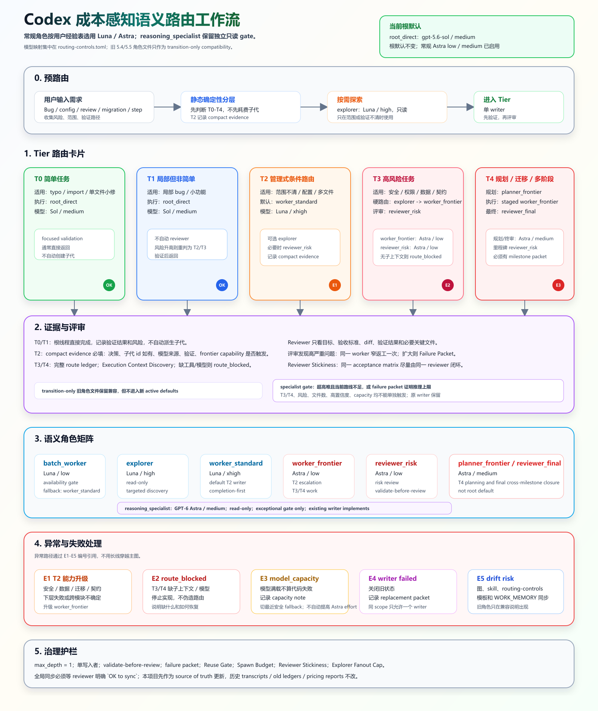

# Codex Cost-Aware Routing

按任务难度、风险和经验经济性选择 Codex 模型与代理的工作流。包含可维护的策略、agent 配置、profile、任务模板和验证脚本。

这是由 Codex 读取执行的工作流规则与配置集合，不是独立的自动选模服务。模型可用性、实际代理绑定与沙箱能力需要在运行时核对。

## 当前角色映射

| 职责 | 模型 | 推理档位 |
|---|---|---|
| 日常根线程 | `gpt-5.6-sol` | medium |
| 低风险机械批处理 | `gpt-5.6-luna` | low |
| 只读探索 | `gpt-5.6-luna` | high |
| 常规实施 | `gpt-5.6-luna` | xhigh |
| 高能力实施、风险评审 | `gpt-6-astra` | low |
| 规划、最终评审 | `gpt-6-astra` | medium |
| 受限推理专家 | `gpt-6-astra` | medium，需独立证据门槛 |

映射依据见 [经济性参考](docs/references/model-economics-reference.2026-09-24.md)。能力分和消耗是用户提供的经验估计，不是官方价格，也不保证不同任务上的效果相同。Luna 不可用或不适合时，记录原因后使用指定 Terra 回退。Astra high 需要 medium 推理不足的证据，xhigh/max/ultra 需要用户明确要求和运行时支持。

## 路由流程

- T0/T1：根线程执行与针对性验证，不自动创建子代理。
- T2：按范围、风险和验证不确定性决定是否委派，保留简短路由证据。
- T3/T4：执行独立的探索、实施、规划或审查角色，不能用单线程扮演多角色代替。
- 默认单个实施代理；先验证、再审查；失败后整理 failure packet，避免盲目重试。
- 核对实际注册模型；旧映射使用显式模型和档位调用，并记录真实的沙箱约束。提示词只读不等同于沙箱隔离。



## 文件结构

- [routing-controls.toml](codex-home/routing-controls.toml)：角色映射与工作流策略。
- [SKILL.md](codex-home/skills/codex-workflow/SKILL.md)：工作流入口。
- [CODEX_WORKFLOW.md](codex-home/skills/codex-workflow/CODEX_WORKFLOW.md)：详细说明。
- `codex-home/agents/`：代理模板；旧 5.4/5.5 角色仅供历史兼容。
- `codex-home/profiles/`：模型配置及明确的回退 profile。
- `codex-home/templates/`：路由记录、里程碑交接模板。
- `scripts/`：同步、校验及历史经济性分析工具。

## 在自己的环境中使用

本项目保留原作者的 Windows 路径和个人工作流约定。部署前请检查并修改 `codex-home/AGENTS.md` 中的本地路径、语音命令，以及 skill、脚本中的运行环境引用。语音工具属于外部项目，本仓库不附带它。

先备份目标 Codex 配置目录中的同名文件，再预览同步操作：

```powershell
.\scripts\sync-to-codex-home.ps1 -CodexHome "$env:USERPROFILE\.codex" -WhatIf
```

确认目标与文件清单后同步：

```powershell
.\scripts\sync-to-codex-home.ps1 -CodexHome "$env:USERPROFILE\.codex"
```

同步脚本会覆盖管理范围内的同名文件，包括全局 `AGENTS.md`，不会自动备份，也不会自动合并 `config.toml`。只将 [config-routing-snippet.toml](codex-home/config-routing-snippet.toml) 中需要的键合并到已有配置，保留插件、MCP 等其他配置。不要将 `routing-controls.toml` 的自定义策略键直接放入 `config.toml`。

现有任务可能仍持有旧模型绑定；新上下文需要重新加载配置，并核对实际模型及档位。

## 验证

```powershell
.\scripts\test-routing-policy.ps1
```

当前验证脚本从作者的 `E:\CodexWorkSpace\工作环境必要配置\tool-routing.json` 读取 Python 路径；其他机器需适配该路径或 Python 入口，并使用支持 `tomllib` 的 Python 3.11+。检查覆盖角色、agent、profile、回退配置的一致性，以及常规 Astra 路由与受限专家的边界。

流程图源文件为 [SVG](docs/current-routing-workflow.svg)。PNG 是便于查看的导出版本。

## 公开范围与历史工具

原始 Codex 对话、内部工作记忆、机器部署记录、历史来源文档及本地备份不在公开仓库中；这些内容由 `.gitignore` 排除。本地维护时可保留 `WORK_MEMORY.md`，不要提交会话或认证数据。

`scripts/estimate-routing-economics.mjs` 和 `docs/pricing/openai-price-book.2026-06-11.json` 是历史试算工具与日期固定的参考数据，尚未用于当前 Luna/Astra 路由的费用评估。该脚本依赖本地 `docs/transcripts/*.jsonl`，公开仓库不提供这些输入；不要将旧试算结果当作当前费用或 Codex 账单。
